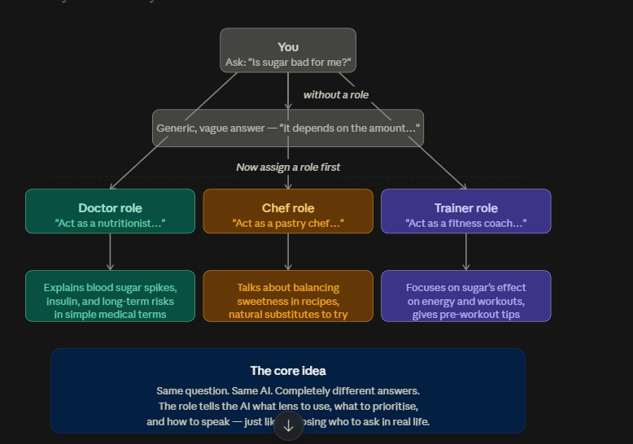
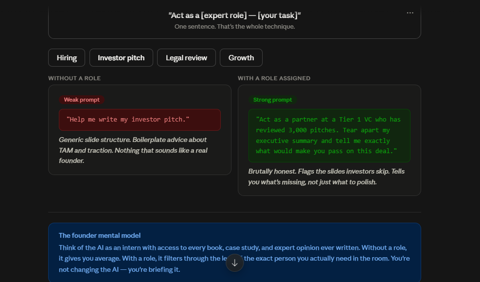
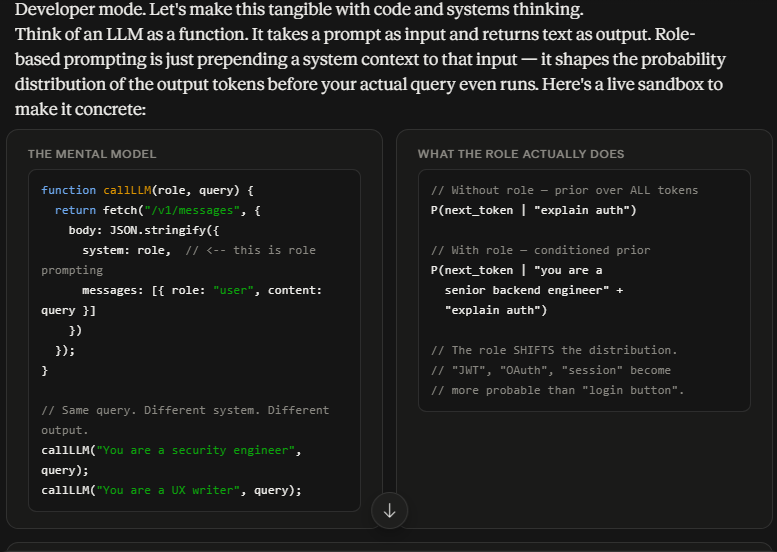

#prompt 1 : without any role:
how you can explain role based prompting to the person who dont know anything about ai and prompt engineering

ouput:

Here's a simple way to think about role-based prompting:

Imagine you need advice. Who you ask shapes the answer you get — you'd ask different questions of a doctor vs. a chef vs. a lawyer, even if the topic overlapped. Role-based prompting works exactly the same way with AI.

So what does it actually look like?

Instead of just asking: "Is sugar bad for me?"

You say: "Act as a nutritionist. Is sugar bad for me?"

That one extra sentence completely changes how the AI frames its answer — the vocabulary it uses, the details it picks, the advice it gives.

Why does it work?

AI models are trained on enormous amounts of human writing. When you say "act as a lawyer," the AI essentially shifts into all the patterns, language, and reasoning it's absorbed from legal writing. It's not pretending — it's filtering through a specific lens.

A dead simple formula to remember:

"Act as a [role]. [Your question or task]."

That's it. No technical knowledge needed. The more specific your role, the sharper the answer — "act as a pediatric nurse explaining this to a worried parent" will get you something very different from just "act as a doctor."

#prompt 2: founder persona:
act as a founder persona how you can explain role based prompting to the person who dont know anything about ai and prompt engineering

output:

Alright, founder hat on. Here's how I'd pitch this to someone who's never touched AI.

You know how when you hire someone, the job title matters enormously? A "finance intern" and a "CFO" can both run your numbers — but the CFO brings judgment, vocabulary, patterns, and priorities that the intern just doesn't have yet. Same task. Completely different output.

That's role-based prompting. You're not changing the AI. You're giving it a job title before it starts working.

Here's the cheat code every founder should tattoo on their hand:

"Act as a [specific person with specific expertise]. Now [your actual request]."

Let me show you what changes:

The real unlock — and this is what most people miss — is that the role isn't just about topic, it's about perspective and stakes. When you say "act as a VC partner reviewing 3,000 pitches," you're not just getting pitch advice. You're getting advice filtered through someone who has pattern-matched failures at scale. That's a completely different lens than "give me pitch tips."

Three things that make a role prompt actually work:

The expertise has to be specific — "marketing expert" is useless, "growth advisor who scaled B2B SaaS companies from $0 to $1M ARR" is useful. The stakes or context matter — "who has reviewed 3,000 pitches" tells the AI what kind of judgment to apply. And the task needs constraints — "for a 2-person team with no budget" forces the answer to be actionable for your situation, not the average situation.

That's the whole game. Specificity is leverage.

#prompt 3: developer persona:

act as a developer persona how you can explain role based prompting to the person who dont know anything about ai and prompt engineering

ouput:

Developer mode. Let's make this tangible with code and systems thinking.

Think of an LLM as a function. It takes a prompt as input and returns text as output. Role-based prompting is just prepending a system context to that input — it shapes the probability distribution of the output tokens before your actual query even runs. Here's a live sandbox to make it concrete:

Hit "Run" with each role selected and watch the output change. The query is identical every time — "What could go wrong here?" — the only variable is the system prompt.

Here's the underlying mechanism as a dev: an LLM is predicting the next token given all prior tokens. When you prepend "You are a senior security engineer", you're literally conditioning the probability distribution before your actual content arrives. The model has seen millions of tokens written by security engineers — that role injection steers sampling toward that part of the learned distribution.

Three things that make a role prompt behave like a typed interface rather than a magic spell:

The role should be a real job title or persona, not a vague label — "senior backend engineer who has scaled Node.js services to 10M RPS" gives the model a much sharper prior than "coding expert". Constraints are load-bearing — "be terse, use bullet points, assume I know the basics" is the equivalent of passing typed props into a component, not hoping for defaults you like. And stacking roles compounds the effect — "You are a staff engineer doing a security review of a junior dev's PR" merges two priors simultaneously and produces output that carries both lenses at once.

The formula you can hand to anyone on your team: "Act as [specific role] who [context/constraints]. [Behavioral instruction]." That's it. Everything else is tuning.

