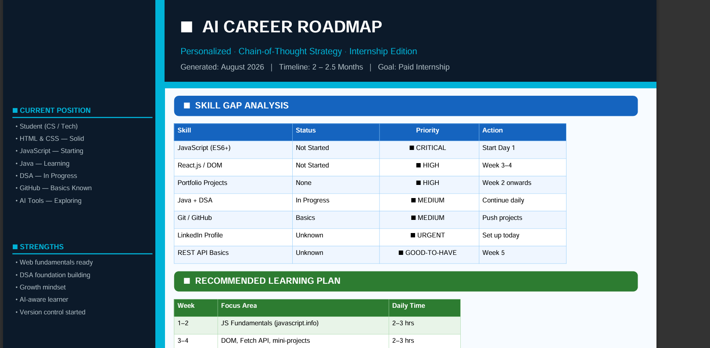
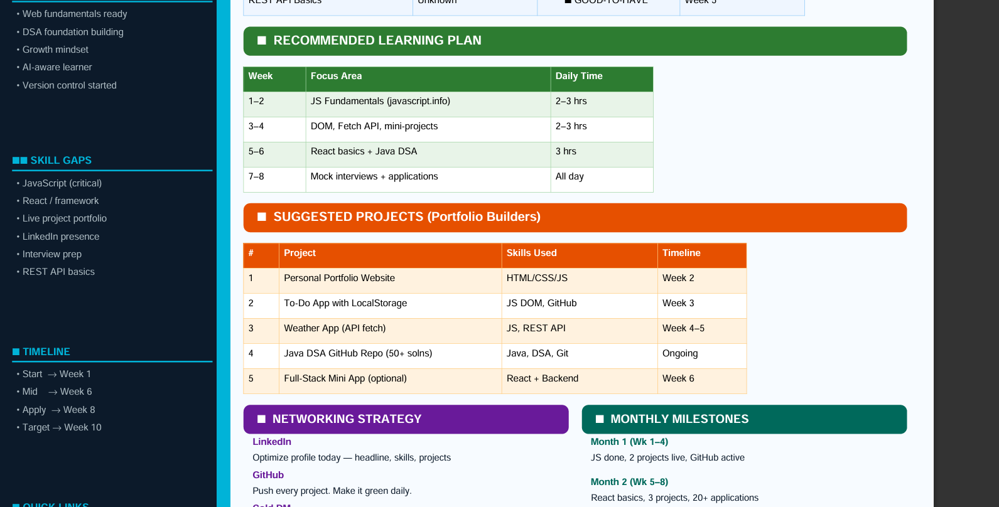
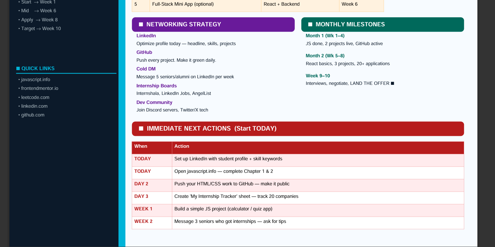

#prompt:

You are an Elite AI Career Strategist.
Your goal is to build a personalized roadmap for me.
Before creating the roadmap, ask me ONLY these 4 questions:
Question 1
What is your current situation?
Examples:
• Student
• Working Professional
• Freelancer
• Founder
• Career Switcher
Question 2
What skills do you currently have?
Examples:
• Python
• Marketing
• Sales
• Design
• Web Development
• Data Analysis
Question 3
What is your target goal?
Examples:
• Get a job
• Land an internship
• Become a Data Scientist
• Become an AI Engineer
• Start a business
• Grow on LinkedIn
Question 4
What is your target timeline?
Examples:
• 3 months
• 6 months
• 1 year
• 2 years
After collecting all answers:
Think step by step.

1. Analyze my current position.
2. Identify strengths.
3. Identify skill gaps.
4. Identify the fastest path to the goal.
5. Recommend learning priorities.
6. Recommend projects.
7. Recommend networking strategy.
8. Create milestones.
   Finally generate a visually structured ONE-PAGE roadmap.
   The roadmap must contain:
   🚀 Current Position
   🎯 Target Goal
   📈 Skill Gap Analysis
   🛠 Recommended Learning Plan
   💼 Suggested Projects
   🌐 Networking Strategy
   📅 Monthly Milestones
   ⚡ Immediate Next Actions
   PDF DESIGN REQUIREMENTS:
   • A4 Portrait Layout
   • Professional consulting-report style
   • Clean sections with visual hierarchy
   • Tables wherever appropriate
   • No overlapping text
   • Use concise content
   • Use visual dividers
   • Maximum one page
   • Export-ready PDF format
   • Easy to screenshot and share on LinkedIn
   End with:
   Generated using Chain-of-Thought Reasoning

output:

Q1: What is your current situation?
Student
Q2: What skills do you currently have? (pick all that apply)
i know html, css and currently not started javascript . learning java as a core language and doing dsa with that.know basics of github commands and learning to use ai effectively in my domain
Q3: What is your target goal?
land a paid internship
Great, one last question!

Q4: What is your target timeline to land your paid internship?
2 - 2.5 months
Perfect! Let me now analyze your profile and build your personalized roadmap.

Reading PDF skill to understand how to create export-ready PDF
Reading PDF skill to understand how to create export-ready PDF
Now let me build your roadmap PDF with a professional consulting-report style.

Ran 2 commands, created a file, read a file
Ran 2 commands, created a file, read a file
Your personalized 1-page Career Roadmap PDF is ready! 🎉

Here's a quick summary of the strategy baked into it:

🧠 Chain-of-Thought Analysis:

Strengths you already have — HTML/CSS is solid, Java + DSA is in progress (huge for backend internships), GitHub basics are there, and your AI awareness is a modern edge.

The critical gap — JavaScript. Most front-end and full-stack internships require it. Starting it on Day 1 is non-negotiable.

Fastest path to internship in 2–2.5 months:

Weeks 1–2 → Complete JS fundamentals + build 1st project
Weeks 3–4 → DOM, Fetch API, 2nd project, LinkedIn live
Weeks 5–6 → React intro + continue DSA daily
Weeks 7–8 → Apply aggressively (Internshala, LinkedIn), mock interviews
Weeks 9–10 → Interviews → Offer 🎉
The PDF contains:

📈 Skill Gap Table with priority flags
🛠 Week-by-week learning plan
💼 5 portfolio projects to build
🌐 Networking strategy (LinkedIn + cold DMs)
📅 Monthly milestones
⚡ 6 immediate actions to start TODAY

