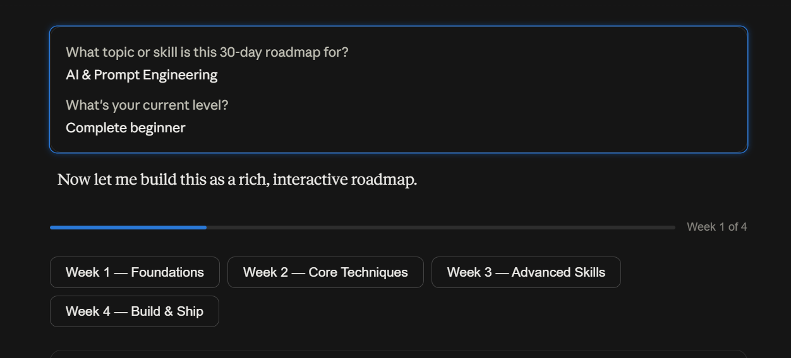
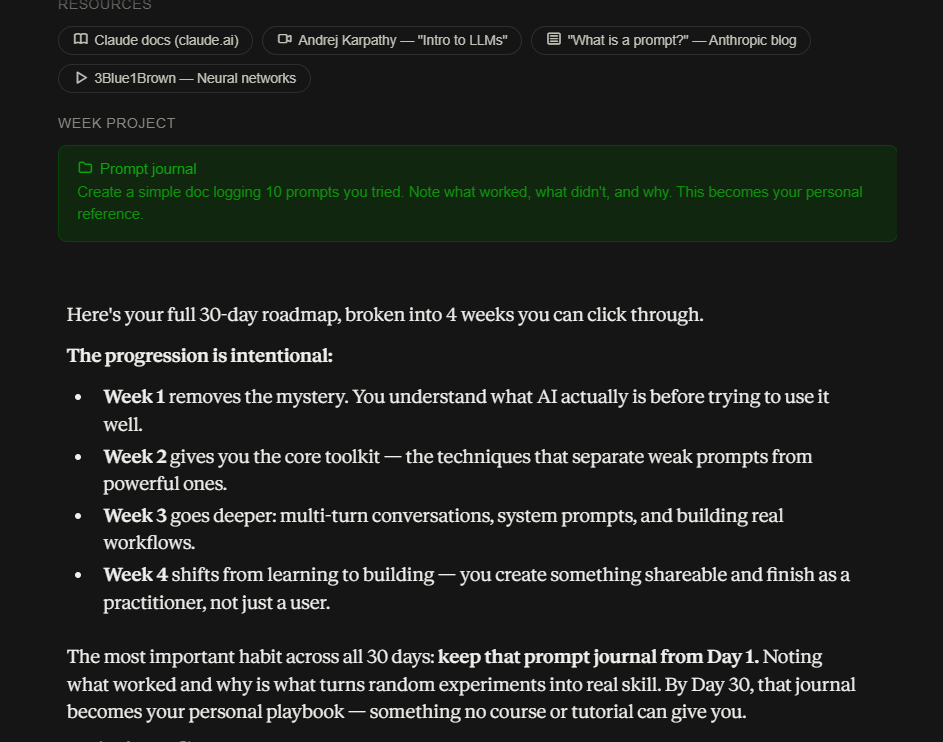

```
PROMPT A (WITHOUT CONTEXT)

Create a 30-day learning roadmap.

Include:
- Weekly milestones
- Daily tasks
- Resources
- Projects
- Final outcome

Make it practical and beginner-friendly.
```

output:  





```


PROMPT B (WITH CONTEXT)

Create a 30-day learning roadmap.

Context:
- Current Situation: [Student]
- Current Skills: [currently learning  60 days of claude challenge and basics of web dev and basics of github and learning java with dsa soon]
- Goal: [crack a paid internship to be financially independent]
- Available Time: [3-4 hrs]
- Experience Level: [Beginner]
- Preferred Learning Style: [hinglish and english like kunal kushwaha Videos with projects . hands on learning]

Include:
- Weekly milestones
- Daily tasks
- Resources
- Projects
- Final outcome

Make it practical and beginner-friendly.

Compare both outputs and identify:
1. Which roadmap feels more personalized?
2. Which roadmap would you actually follow?
3. What role did context play in improving the result?
```

output:


