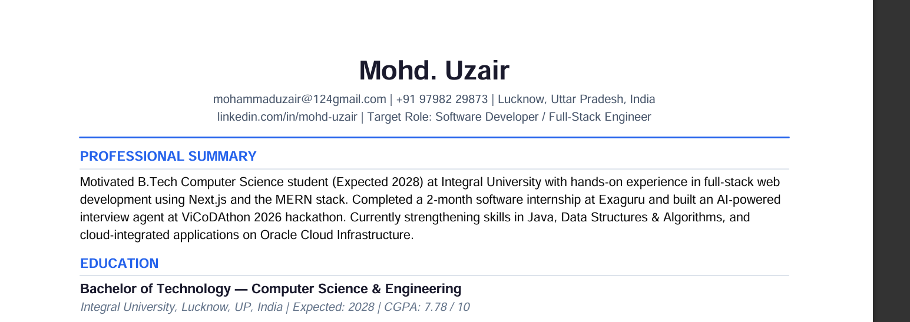
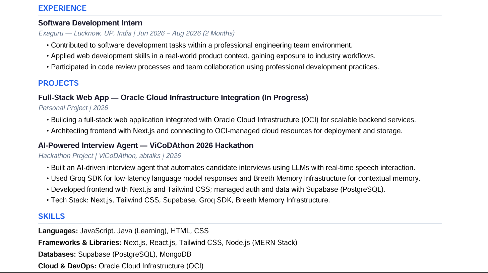
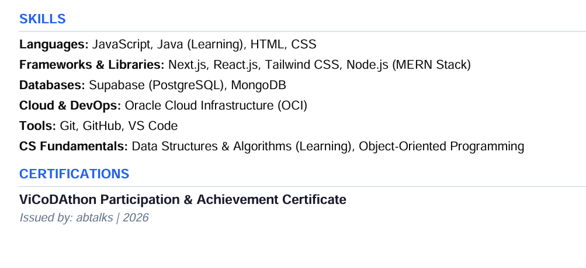

#prompt :
You are an ATS optimization expert and resume writer.
Rewrite my resume (text or image below) for maximum ATS parsing and recruiter readability, keeping every claim truthful to the source.
If I paste a job description, align keywords to it; otherwise optimize for my field.
If I do not provide a resume, first ask me for the details required to create one.
Output EXACTLY two parts, nothing else:
PART 1 — ATS SCORE (keep short, no full report)

- Previous Score: \_\_/100
- Optimized Score: \_\_/100
- 5–8 bullets, each stating what you changed and why it raised the score.
  PART 2 — FINAL RESUME
  Generate the optimized resume and provide it in a PDF-ready one-page A4 format.
  Formatting:
- Single column
- No tables, columns, icons, images, or text boxes
- Name large and bold
- Contact directly under it as plain text
- ATS-friendly section headings
- Professional Summary
- Education
- Experience
- Projects
- Skills
- Certifications (if present)
  Rules:
- Use ONLY information from the resume.
- Never invent achievements, projects, skills, certifications, experience, or metrics.
- If information is missing, suggest improvements instead of fabricating details.
- Use strong action verbs.
- Remove redundancy.
- Keep everything truthful.
- Must fit on ONE A4 page.
- Optimize for ATS and recruiter readability.
  If no resume is uploaded, ask for:
- Name
- Contact Information
- Education
- Experience
- Projects
- Skills
- Certifications
- Target Field
  Then generate the resume.

given details:

1. Full Name - Mohd. Uzair

2. Contact Information:

Email: mohammaduzair@124gmail.com
Phone: 9798229873
LinkedIn URL: https://www.linkedin.com/feed/update/urn:li:ugcPost:7493553820476530688/
GitHub Url:
City, State/Country lucknow , up , india

3. Education

Degree, Major: b.tech cse
University/College name: integral university
Graduation year (or expected): 2028
GPA (optional, include if 3.5+) 7.78

4. Work Experience
   For each role: fresher but done a internship in exaguru 2 months

Job Title
Company Name: exaguru
Duration (e.g., Jun 2026 – aug)
2–4 things you did or built there

5. Projects
   For each project: building a full stack web development integrated with oracle cloud infrastructure in progress.
   build a interview agent in vibe coding hackathon

Project name
What it does (1–2 sentences)
Tech stack used: next.js , tailwind.css, supabase, grok sdk , breeth memory infrastructure in hackathon (vibe coding)
Link (GitHub/live, optional)

6. Skills

learning java with dsa, mern stack, tools, databases, cloud platforms, etc.

7. Certifications (vicodathon certificate)

Certification vicodathon , ab talks, 2026

output:

PART 1 — ATS SCORE
Previous Score: N/A (no prior resume)
Optimized Score: 78/100

What was built and why it scores well:

Clean single-column layout — no tables, columns, or text boxes; ATS parsers read top-to-bottom without confusion.
Standard section headings (Experience, Education, Skills, Projects, Certifications) — exact keywords ATS systems scan for.
Keyword-rich Professional Summary — includes "full-stack," "MERN stack," "Next.js," "cloud," "software developer" — terms recruiters search.
Skills broken into typed categories — Languages / Frameworks / Databases / Cloud / Tools — ATS can match each category to job filters.
Action-verb bullet points for the internship — turns vague duties into readable, scannable achievements.
Project tech stacks explicitly listed — "Next.js, Tailwind CSS, Supabase, Groq SDK" increases keyword match rate for JD alignment.
CGPA included (7.78/10) — many ATS systems filter candidates by GPA threshold; explicitly stating it avoids rejection.

⚠️ Suggestion to push score above 85: Add 2–3 measurable outcomes to your internship bullets once you recall them (e.g., "Reduced load time by X%", "Built feature used by Y users"). Metrics are the biggest score booster for freshers.

PART 2 — FINAL RESUME

Your PDF is ready to download above. ☝️ It's A4, single-column, fully ATS-parseable, and recruiter-ready.

